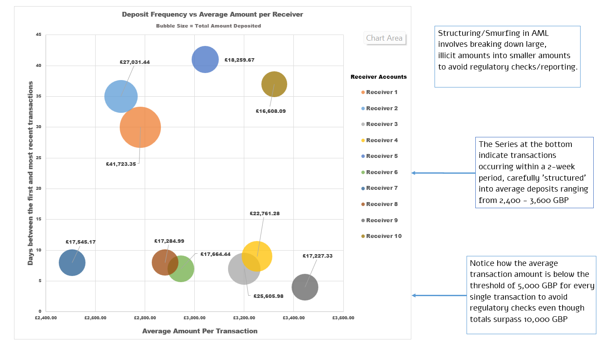

# AML Data Visualization Project

## Initial Exploratory Data Analysis
1. Discovered that the 9.5M+ rows simply cannot be loaded into an Excel sheet, given Excel's current limit of about 1M+ rows.
2. Loaded the table into Power Pivot for quick load times, and smoother exploration. (Later, I removed the Power Pivot processed dataset as I moved on from EDA, as this significantly increased the .xlsx file size)
3. This sample AML dataset includes 12 features and 28 different typologies, so I decided to start small  and explore the Structuring/Smurfing dataset that I am familiar with.
4. Switched to Power Query for the ETL (Extract, Transform, Load) processing. The data needed to be  filtered, grouped, and structured to be much less than 9M rows and be in a sensible format for visualization.

## Phase 2: Transforming the Data
1. Using the GUI elements and M Code, I began filtering down the dataset in Power Query.
2. As a best practice, I referenced the base data in a new query (Remember, I need to explore other typologies later).
3. I filtered the data for "Cash Deposit" transactions using the `Payment_type` feature in the dataset as this is the most common method smurfers use to hide their tracks.
```
#"Filter for Cash Deposits" = Table.SelectRows(Source, each [Payment_type] = "Cash Deposit")
```
4. Then, I grouped by `Receiver_account` to analyze Total Cash Deposits, Transaction Count, Average Cash Deposit, and the timeline between the first recorded transaction and the latest one.
```
#"Group by receiver" = Table.Group(#"Filter for Cash Deposits", "Receiver_account", 
                            {{"Total Cash Deposit", each List.Sum([Amount])},
                            {"Average Cash Deposit", each List.Average([Amount])},
                            {"Transaction Count", each List.Count([Date])}, 
                            {"Day Span", each Duration.Days(List.Max([Date])-List.Min([Date]))}})
```
5. This revealed expected patterns in regards to Smurfing/Structuring patterns. Several smaller cash deposits (below the 5,000 GBP threshold) being made to the same receiver account over short periods of time:


6. I then went on to flag and segregate higher risk transactions involving either high amounts (15,000+ GBP) in a spread out duration (closer to 45 days) or amounts deliberately separated into small sections totalling more than 10,000 GBP over a couple of months, etc.
```
#"Flag High Risk" = Table.AddColumn(#"Add Frequency column", "High Risk Flag", 
                        each if ([Total Cash Deposit] >= 5000) and ([Day Span] <= 14) then "HIGH - FAST" 
                            else if ([Total Cash Deposit] >= 10000) and ([Day Span] <= 45) then "HIGH - SLOW" 
                            else if ([Total Cash Deposit] >= 15000) and ([Day Span] <= 200) then "MEDIUM"
                            else "LOW")
```

## Phase 3: Visualization
1. Choosing a chart to represent these complicated yet clearly occuring patterns of financial data was no simple task for a beginner like myself.
2. I enlisted the help of ChatGPT to analyze the pros and cons of choosing various chart types like a bubble chart, or a scatter plot, or something along the lines of a heat map.
3. I eventually came to the conclusion that bubble charts displayed the most amount of data, enabling me to paint the picture of this sneaky AML pattern:



### Credits for the dataset:
B. Oztas, D. Cetinkaya, F. Adedoyin, M. Budka, H. Dogan and G. Aksu, "Enhancing Anti-Money Laundering: Development of a Synthetic Transaction Monitoring Dataset," 2023 IEEE International Conference on e-Business Engineering (ICEBE), Sydney, Australia, 2023, pp. 47-54, doi: 10.1109/ICEBE59045.2023.00028.
